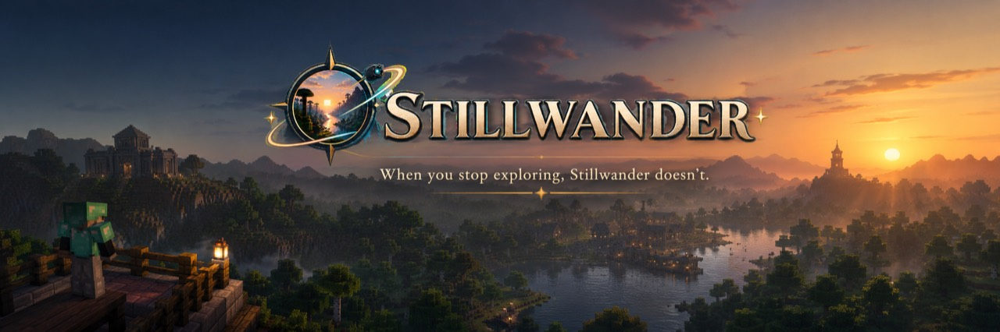
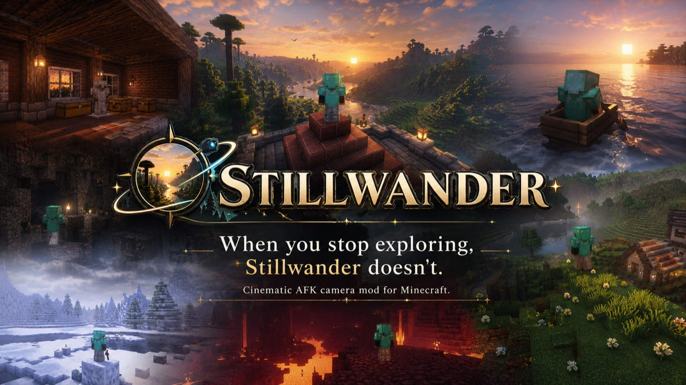
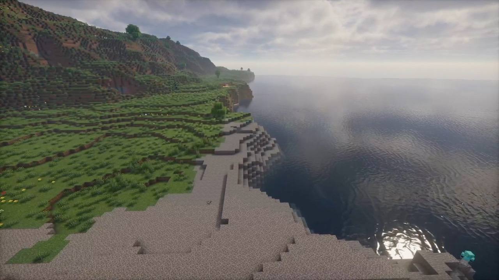
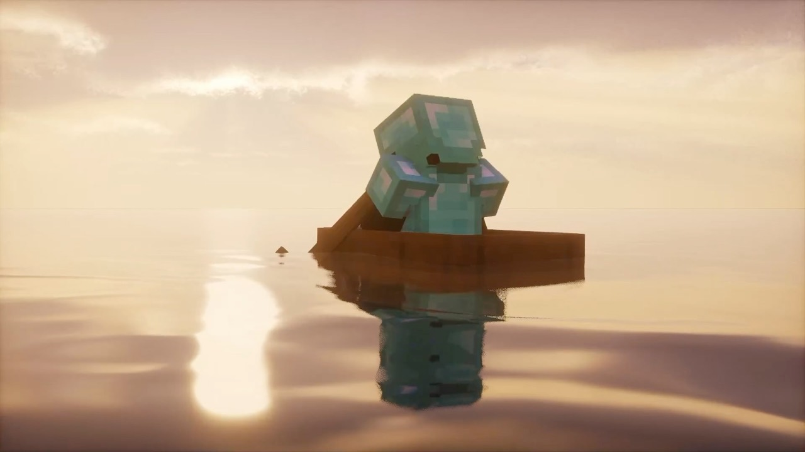
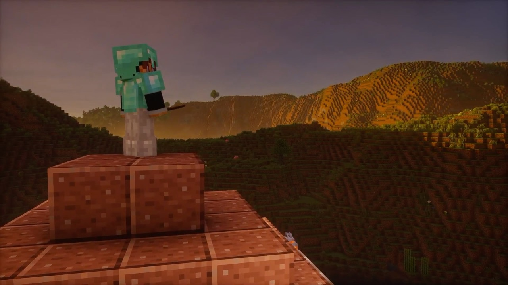
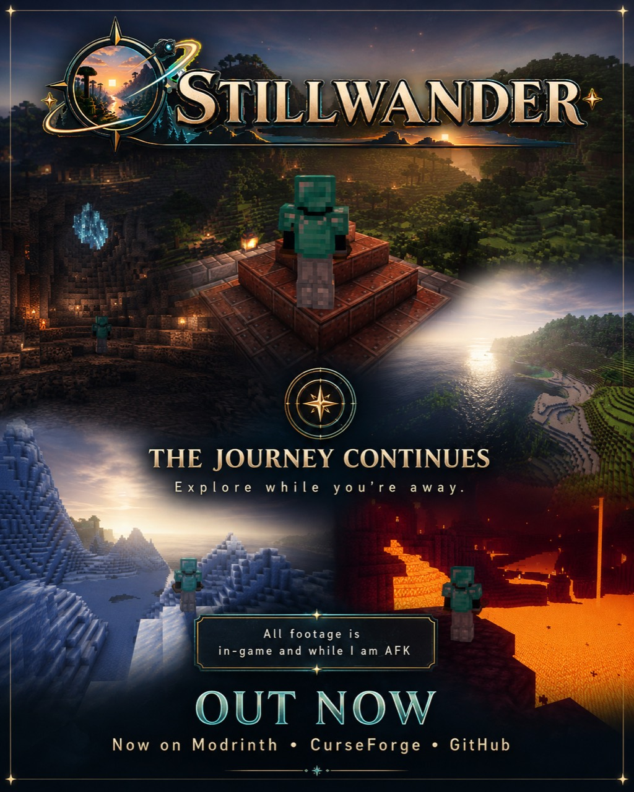

<p align="center">
  
</p>

<h1 align="center">Still Wander</h1>

<p align="center">
  <strong>When you stop exploring, Still Wander doesn't.</strong><br>
  A cinematic AFK camera mod for Minecraft Fabric.
</p>

<p align="center">
  
  
  
</p>

Still Wander turns idle moments into a slow, cinematic journey through the world around you. Its environment-aware camera chooses varied player, landscape, cave, structure, and entity compositions, then moves between them with smooth pans, deliberate pacing, and independent cinematic FOV.

- **Scene-aware direction** adapts shots to open landscapes, forests, interiors, caves, weather, time, nearby entities, and terrain.
- **Cinematic movement** blends slow pans, tracking shots, wide establishing views, intimate details, and occasional static compositions.
- **Safe AFK behavior** returns control immediately when you move, interact, or take damage.
- **Client-side only** means nothing needs to be installed on the server.

<p align="center">
  
</p>

## In-game screenshots

<p align="center"><em>Captured in-game while Still Wander was active.</em></p>

<p align="center">
  
</p>

<table>
  <tr>
    <td width="50%"></td>
    <td width="50%"></td>
  </tr>
</table>

## Downloads and compatibility

Choose the JAR that exactly matches your Minecraft version.

| Minecraft | Java | Built against Fabric API | Download | Verification |
| --- | --- | --- | --- | --- |
| 1.20.1 | 17+ | 0.92.11+1.20.1 | [Download](versions/stillwander-1.0.0+1.20.1.jar) | Build and static compatibility checks |
| 1.20.4 | 17+ | 0.97.3+1.20.4 | [Download](versions/stillwander-1.0.0+1.20.4.jar) | Build and static compatibility checks |
| 1.21.1 | 21+ | 0.116.15+1.21.1 | [Download](versions/stillwander-1.0.0+1.21.1.jar) | Build and static compatibility checks |
| 1.21.4 | 21+ | 0.119.4+1.21.4 | [Download](versions/stillwander-1.0.0+1.21.4.jar) | Build and static compatibility checks |
| 1.21.8 | 21+ | 0.136.1+1.21.8 | [Download](versions/stillwander-1.0.0+1.21.8.jar) | Build and static compatibility checks |
| 1.21.11 | 21+ | 0.141.6+1.21.11 | [Download](versions/stillwander-1.0.0+1.21.11.jar) | In-game tested |
| 26.1 | 25+ | 0.145.1+26.1 | [Download](versions/stillwander-1.0.0+26.1.jar) | Build and static compatibility checks |
| 26.1.1 | 25+ | 0.145.4+26.1.1 | [Download](versions/stillwander-1.0.0+26.1.1.jar) | Build and static compatibility checks |
| 26.1.2 | 25+ | 0.155.2+26.1.2 | [Download](versions/stillwander-1.0.0+26.1.2.jar) | Build and static compatibility checks |
| 26.2 | 25+ | 0.158.0+26.2 | [Download](versions/stillwander-1.0.0+26.2.jar) | Build and static compatibility checks |

All builds require Fabric Loader 0.19.3 or newer and Fabric API for the same Minecraft version. The Fabric API versions above are the versions used to build each JAR; a newer compatible Fabric API release for that same Minecraft version may also work.

## Install

1. Install Fabric Loader for your Minecraft version.
2. Install Fabric API for that same Minecraft version.
3. Download the matching Still Wander JAR and place it in the Minecraft `mods` folder.
4. Start Minecraft and enter a world.

## Controls

| Action | Default |
| --- | --- |
| Start or stop Still Wander immediately | `B` |
| Cut to the next shot | `N` |
| Open Still Wander settings | `F7` |
| Toggle uninterrupted capture mode | `F8` |
| Start automatically | Remain idle for 25 seconds |
| Exit normal cinematic mode | Move, interact, or take damage |

Keys can be changed from Minecraft's **Options > Controls > Key Binds** screen.

### Capturing footage and screenshots

`F8` starts Still Wander immediately in uninterrupted capture mode. In this mode, movement and normal player input do not stop the cinematic camera, making it suitable for recording video or composing screenshots.

For a session that also continues when the player takes damage, press `F7` first and turn **Exit on damage** off. Then press `F8`, start your preferred screen recorder, or use Minecraft's `F2` key to capture screenshots. Press `F8` again when you are finished.

Still Wander controls the cinematic camera; it does not encode an MP4 video itself. Use recording software such as OBS Studio, Xbox Game Bar, or another capture tool for video.

## Source and build

The actual Still Wander client source is public in [`source/1.21.11`](source/1.21.11). It is the authored 1.1.1 implementation that became Still Wander 1.0.0, with the public branding applied directly in source rather than by patching a compiled JAR.

The internal Java package and several class names still use `com.cinecraft`, the project's original working-title namespace. They are retained deliberately for binary traceability; the installed mod ID, resources, configuration, controls, and user-facing name are `stillwander` / Still Wander.

To build the canonical Minecraft 1.21.11 release on Windows:

```powershell
.\gradlew.bat -p source\1.21.11 clean build
```

On Linux or macOS:

```bash
./gradlew -p source/1.21.11 clean build
```

The distributable JAR is written to `source/1.21.11/build/libs`. The build requires Java 21 and downloads the declared Minecraft, Yarn, Fabric Loader, Fabric API, and Fabric Loom dependencies on first use. It does not need to launch Minecraft.

This source tree targets 1.21.11. The other downloads in `versions/` are mapping/API compatibility ports of the same Still Wander 1.0 behavior; this repository does not claim that those version-specific JARs can be rebuilt unchanged from the 1.21.11 project.

The full development timeline, binary verification, relationship to IDLE, and AI disclosure are documented in [PROVENANCE.md](PROVENANCE.md).

## License

The code is public for inspection and release verification but is not currently open-source licensed. See [LICENSE](LICENSE). A more permissive license can be chosen later without obscuring the present source history.

## Promotional artwork

<details>
  <summary><strong>View the Still Wander release poster</strong></summary>
  <br>
  <p align="center">
    
  </p>
</details>

The Still Wander name, logo, artwork, and distributed mod files are © 2026 Prasanna Kulkarni. All rights reserved.

Developed by [Prasanna163](https://github.com/Prasanna163) with generative-AI coding assistance.
